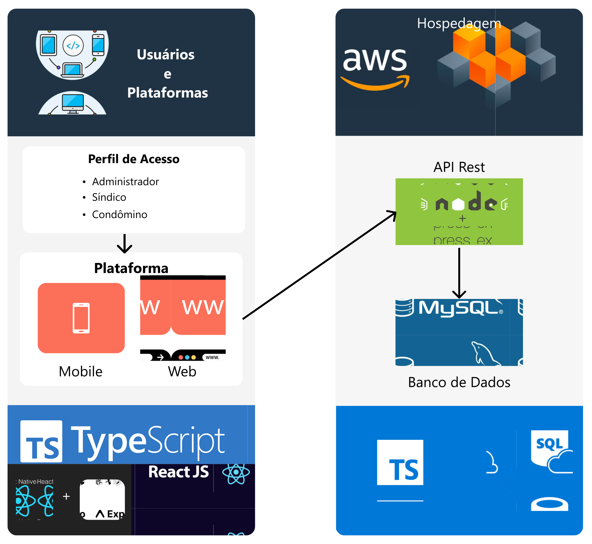

# Introdução

A administração de condomínios é uma tarefa complexa que exige organização, transparência e eficiência. A falta de ferramentas adequadas para gerenciar pagamentos,
monitorar inadimplência e garantir uma comunicação eficiente entre síndicos, administradores e moradores pode gerar dificuldades e impactos negativos na gestão condominial. 
Muitos condomínios ainda utilizam processos manuais ou sistemas desatualizados, o que resulta em ineficiências operacionais, atrasos no processamento de informações e
dificuldades na tomada de decisão.
Com o avanço da tecnologia e a crescente digitalização dos serviços administrativos, a necessidade de soluções inovadoras para otimizar a gestão condominial torna-se cada vez mais evidente. Nesse contexto, este projeto tem como objetivo desenvolver um MVP (Minimum Viable Product) de uma aplicação web e mobile que simplifique e automatize a administração de condomínios, proporcionando uma experiência mais eficiente e segura para todos os envolvidos.

A plataforma proposta oferecerá funcionalidades essenciais para facilitar a gestão financeira e operacional, como o acompanhamento de 
pagamentos,controle de inadimplência, geração de relatórios financeiros e ferramentas de comunicação entre os moradores e a administração. 
Dessa forma, o sistema contribuirá para uma maior transparência e praticidade no gerenciamento das atividades condominiais.

Além da eficiência operacional, este projeto também visa atender inicialmente aos perfis de usuários, como síndicos e administradores, assim como o perfil de condômino 
como os moradores,garantindo uma solução acessível e intuitiva. A segurança da informação será um fator chave, assegurando a proteção de dados sensíveis e a conformidade
com normativas vigentes, como a Lei Geral de Proteção de Dados (LGPD).

Assim, este projeto se propõe a ser uma solução para modernizar a gestão condominial, reduzindo burocracias, aumentando a eficiência e
promovendo um ambiente mais organizado e funcional para todos os envolvidos.

## Problema

A gestão de condomínios é uma tarefa que envolve a administração de um grande volume de dados, pessoas e solicitações diárias, o que torna o processo altamente complexo e suscetível a problemas. Um condomínio médio pode contar com dezenas ou até centenas de moradores, cada um com demandas específicas, como solicitações de manutenção, dúvidas financeiras ou questões relacionadas à convivência coletiva. A falta de uma ferramenta eficiente para gerenciar essas interações pode resultar em confusões, perda de informações e falhas na comunicação.

Um estudo realizado pela Associação Brasileira de Condomínios e Empresas (ABACE) revelou que a falta de organização das informações e a dificuldade na comunicação são os principais problemas enfrentados por condomínios que não utilizam sistemas de gestão. Essa pesquisa destaca que cerca de 65% dos síndicos entrevistados relataram dificuldades em acompanhar as solicitações dos moradores, enquanto 70% apontaram a inadimplência e os erros na gestão financeira como desafios recorrentes.

A falta de integração entre dados e processos agrava ainda mais esses problemas. Por exemplo, informações sobre manutenções, assembleias e documentos importantes ficam espalhadas em planilhas ou arquivos físicos, dificultando o acesso rápido quando necessário. Esse cenário caótico reforça a necessidade de uma solução específica que consiga lidar com o grande volume de dados e demandas de maneira organizada, garantindo maior segurança, agilidade e transparência para todos os envolvidos.

## Objetivos

Desenvolver um MVP de uma aplicação web e mobile para otimizar a gestão financeira e administrativa de condomínios, facilitando o pagamento das taxas pelos inquilinos e disponibilizar uma ferramenta eficiente para a administração condominial. Após a criação do MVP, novas funcionalidades poderão ser adicionadas conforme a evolução do projeto e as necessidades dos usuários.

## Objetivos Específicos

- Facilitar a gestão de pagamentos dos inquilinos: Implementar funcionalidades que permitam aos moradores visualizar boletos, realizar pagamentos e acompanhar o histórico de suas despesas condominiais, garantindo transparência e praticidade.

- Apoiar a administração condominial: Disponibilizar ferramentas para que síndicos e administradores possam gerenciar pagamentos recebidos, acompanhar inadimplências e gerar relatórios financeiros de maneira automatizada.

## Justificativa

A administração de condomínios envolve uma ampla gama de atividades que precisam ser gerenciadas com precisão e eficiência, incluindo a organização financeira, comunicação entre moradores e gestores, e a execução de tarefas operacionais. Quando esses processos não são adequadamente administrados, os impactos negativos podem ser significativos, resultando em insatisfação dos moradores, atrasos na resolução de demandas, e até conflitos interpessoais. A pesquisa "Condominium Management Challenges" (2021), conduzida pela Global Property Management Alliance (GPMA), apontou que condomínios que não utilizam ferramentas tecnológicas sofrem uma média de 40% mais atrasos no atendimento a solicitações de moradores, em comparação com aqueles que adotam sistemas integrados. A falta de automação nos processos administrativos também foi correlacionada com um aumento de 35% nos custos operacionais, devido à ineficiência no controle de manutenções e outros serviços.

A digitalização pode reduzir esses desafios e proporcionar melhorias consideráveis. De acordo com o relatório da McKinsey, "The Productivity Puzzle: Why Companies Should Care" (2021), empresas que investem em automação e digitalização aumentam sua produtividade em até 30%, enquanto o estudo da Gartner, "Top 10 Strategic Technology Trends" (2022), indica que um sistema integrado reduz erros humanos em até 50%, melhorando significativamente a precisão das operações. Esses dados reforçam que a implementação de ferramentas tecnológicas não é apenas uma tendência, mas uma necessidade estratégica para qualquer setor que busca eficiência.
Outra pesquisa relevante, conduzida pela PropTech Insights (2022), revelou que 85% dos moradores de condomínios preferem se comunicar por meio de plataformas digitais, e 78% consideram a transparência financeira um fator crucial para confiar na administração condominial. Sistemas especializados permitem a centralização de dados, oferecendo relatórios detalhados e acessíveis para os condôminos, promovendo um ambiente de confiança e colaboração.

Portanto, a implementação de uma ferramenta digital que integre comunicação, gestão financeira e automação de processos não é apenas uma solução prática para os desafios da administração condominial, mas também um passo estratégico fundamentado em dados e estudos que comprovam seu impacto positivo. Essas soluções promovem maior eficiência, segurança, transparência e confiança, beneficiando tanto os gestores quanto os moradores.

## Público-Alvo

O sistema de gerenciamento de condomínios será utilizado por diferentes perfis de usuários, cada um com necessidades específicas dada as devidas funções e participações dentro do contexto e também diferentes níveis de familiaridades e disponibilidades tecnológicas. O objetivo é garantir uma experiência acessível e eficiente para todos os envolvidos nas operações.
### Usuários

1. Síndicos/Administradores de Condomínio
Esses usuários são os principais responsáveis pela gestão do condomínio, tomando decisões estratégicas e operacionais além das finanças do condomínio. Podem ter experiência variada com tecnologia, desde aqueles mais acostumados a sistemas digitais até outros que preferem processos tradicionais em papel. Buscam otimizar os processos gerenciais do condomínio.

2. Moradores e Proprietários
Os moradores utilizam o sistema principalmente para acompanhar débitos, registrar solicitações, fazer reservas de áreas comuns e participar da comunicação interna do condomínio. Como o público anterior, a experiência e disponibilidade tecnológica é variada.

### Mapa de Stakeholders
- Usuários diretos: síndicos, administradores, moradores.
- Usuários indiretos: contadores, empresas terceirizadas.
- Influenciadores: associações de moradores.

### Conclusão
O sistema deve ser intuitivo, acessível em diferentes dispositivos e garantindo a funcionalidade para suprir às necessidades de cada perfil de usuário. Além disso, a segurança dos dados é um fator chave para garantir a confiabilidade por parte dos usuários.

# Especificações do Projeto

## Requisitos

A classificação das prioridades foi baseada nos seguintes critérios:

ALTA:

- Funcionalidades essenciais para o funcionamento básico do sistema, requisitos relacionados à segurança e integridade dos dados.
- Recursos necessários para conformidade legal
- Funcionalidades que impactam diretamente na operação do condomínio

MÉDIA:

- Funcionalidades que melhoram a experiência do usuário
- Recursos complementares ao funcionamento básico
- Funcionalidades de relatórios e histórico

BAIXA:

- Funcionalidades não essenciais e que podem ser implementados posteriormente
- Melhorias cosméticas ou de conveniência

### Requisitos Funcionais

| ID     | Descrição do Requisito                                                                                                                          | Prioridade | Responsável            |
| ------ | ----------------------------------------------------------------------------------------------------------------------------------------------- | ---------- | ---------------------- |
| RF-001 | Permitir autenticação de usuários através de login e senha                                                                                      | ALTA       | Síndico/Condômino      |
| RF-002 | Permitir que o síndico cadastre / visualize / edite e remova usuários                                                                           | ALTA       | Síndico                |
| RF-003 | Permitir que o síndico cadastre / visualize / edite e remova condomínios                                                                        | ALTA       | Síndico                |
| RF-004 | Permitir que o síndico faça gestão de débito (valor do condominio) informando data de vencimento e se foi pago                                  | ALTA       | Síndico                |
| RF-005 | Permitir diferentes perfis de acesso (síndico, condômino)                                                                                       | ALTA       | Síndico                |
| RF-006 | Permitir que condôminos visualizem seus débitos pendentes                                                                                       | ALTA       | Condômino              |
| RF-007 | Permitir recuperação de senha                                                                                                                   | ALTA       | Síndico/Condômino      |
| RF-008 | Permitir que usuários editem seus dados pessoais                                                                                                | ALTA       | Síndico/Condômino      |
| RF-009 | Permitir que condôminos cadastrem placas de veículos autorizados                                                                                | ALTA       | Condômino              |
| RF-010 | Permitir que administradores do sistema aprovem a solicitação de cadastro de síndicos para gestão de seus condomínios                           | ALTA       | Administrador          |
| RF-011 | Permitir que síndicos visualizem relatórios de inadimplência                                                                                    | MÉDIA      | Síndico                |
| RF-012 | Implementar sistema de comunicação que permita síndicos publicarem avisos e enquetes, e condôminos visualizarem e responderem a estes conteúdos | BAIXA      | Síndico/Condômino      |
| RF-013 | Enviar notificações automáticas sobre débitos pendentes (notificações no app)                                                                   | BAIXA      | Sistema                |

### Requisitos não Funcionais

| ID      | Descrição do Requisito                                                              | Prioridade |
| ------- | ----------------------------------------------------------------------------------- | ---------- |
| RNF-001 | Sistema deve criptografar todas as senhas armazenadas                               | ALTA       |
| RNF-002 | Sistema deve suportar múltiplos acessos simultâneos                                 | ALTA       |
| RNF-003 | Sistema deve estar em conformidade com a LGPD                                       | ALTA       |
| RNF-004 | Sistema deve ser compatível com os principais navegadores (Chrome, Firefox, Safari) | MÉDIA      |
| RNF-005 | Sistema deve ter interface intuitiva e de fácil utilização                          | MÉDIA      |
| RNF-006 | Sistema deve ter documentação técnica atualizada                                    | MÉDIA      |
| RNF-007 | Sistema deve ser responsivo para diferentes tamanhos de tela                        | BAIXA      |

## Restrições

O projeto está restrito pelos itens apresentados na tabela a seguir.

| ID  | Restrição                                                                |
| --- | ------------------------------------------------------------------------ |
| 01  | O sistema deve ser desenvolvido e implementado até o final do semestre   |
| 02  | O sistema deve estar disponível somente em ambientes Web e Mobile        |
| 03  | O sistema deve ser desenvolvido sem investimentos, utilizando apenas ferramentas e serviços gratuitos |

# Catálogo de Serviços

## 1. Serviços de Cadastro e Autenticação

### 1.1. Cadastro de Usuário
**Descrição**: Serviço responsável pelo registro de novos usuários na plataforma.

**Funcionalidades**:
- Cadastro de gestores e condôminos com informações básicas e de contato.
- Validação de identidade por e-mail.

**Benefícios**: Permite um acesso seguro e controlado ao sistema, garantindo a integridade dos dados dos usuários.

### 1.2. Autenticação e Controle de Acesso
**Descrição**: Serviço que permite o login seguro dos usuários no sistema.

**Funcionalidades**:
- Login via e-mail e senha.
- Recuperação e redefinição de senha.
- Controle de sessão e logout seguro.

**Benefícios**: Garante um acesso seguro e confiável ao sistema, protegendo os dados dos usuários.

## 2. Serviços de Gestão Condominial

### 2.1. Gestão de Condôminos, Apartamentos e Vagas
**Descrição**: Serviço voltado para a administração dos dados dos moradores e suas respectivas unidades.

**Funcionalidades**:
- Visualização e atualização das informações dos condôminos.
- Gerenciamento das unidades habitacionais e suas respectivas vagas de estacionamento.
- Remoção de registros de moradores e unidades desocupadas.

**Benefícios**: Organização eficiente dos dados condominiais, facilitando a administração e comunicação.

### 2.2. Gestão de Débitos
**Descrição**: Serviço que permite a visualização e edição das informações de débitos dos condôminos.

**Funcionalidades**:
- Consulta e atualização do status de pagamentos e inadimplências.
- Notificação automática de vencimentos e atrasos.

**Benefícios**: Melhora o controle financeiro do condomínio.

## 3. Serviços para Condôminos

### 3.1. Visualização de Débitos
**Descrição**: Serviço que permite aos condôminos consultarem suas pendências financeiras.

**Funcionalidades**:
- Exibição de faturas em aberto.
- Histórico de pagamentos.
- Alertas de vencimento.

**Benefícios**: Transparência no controle financeiro e incentivo ao pagamento pontual.

### 3.2. Gestão de Perfil
**Descrição**: Serviço que possibilita aos condôminos a atualização de suas informações pessoais.

**Funcionalidades**:
- Edição de dados pessoais, como nome, telefone e e-mail.
- Configuração de preferências de notificação e comunicação.
- Alteração de senha.

**Benefícios**: Maior autonomia para os condôminos gerenciarem suas informações de forma segura e prática.

## 4. Plataforma e Integração

### 4.1. Disponibilidade Multiplataforma
**Descrição**: O sistema estará disponível por meio de diferentes interfaces para facilitar o acesso.

**Funcionalidades**:
- API Rest para integração com outros sistemas e automações.
- Interface web para acesso via navegador.
- Aplicativo móvel para Android e iOS.

**Benefícios**: Acesso facilitado e experiência otimizada para diferentes perfis de usuários.

### 4.2. Notificações e Alertas
**Descrição**: Serviço responsável por manter os usuários informados sobre eventos e pendências.

**Funcionalidades**:
- Notificações push e e-mail sobre débitos e comunicados importantes.
- Alertas personalizados conforme as preferências do usuário.
- Registro de notificações no painel do usuário.

**Benefícios**: Comunicação eficiente e engajamento dos usuários na gestão do condomínio.

# Arquitetura da Solução

O sistema de gestão condominial será composto por três principais camadas: frontend, backend e banco de dados, além de uma arquitetura responsiva e segura, garantindo acesso eficiente e prático a todos os usuários, independentemente de sua plataforma de acesso.

No frontend, a aplicação será desenvolvida utilizando React.js para a versão web e React Native para a versão mobile, ambas proporcionando interfaces interativas e responsivas. Essas tecnologias permitem que a aplicação seja acessada de forma fluida tanto em navegadores quanto em dispositivos móveis, oferecendo uma experiência intuitiva para síndicos, administradores e condôminos. O uso de React Native assegura que o aplicativo móvel tenha desempenho otimizado para sistemas Android e iOS.

O backend será estruturado com Node.js e Express.js, garantindo uma arquitetura robusta e escalável para a gestão dos dados e funcionalidades do sistema. A comunicação entre o frontend e o backend será realizada por meio de APIs RESTful, que permitem uma integração eficaz e flexível com outros sistemas, se necessário. O backend será responsável pela lógica de negócios, incluindo a autenticação de usuários.

O banco de dados utilizado será o MySQL, escolhido por sua confiabilidade, escalabilidade e suporte a transações complexas. Ele armazenará as informações essenciais do sistema, como dados dos usuários, registros financeiros, histórico de pagamentos, entre outros. 

A hospedagem da aplicação será feita na AWS (Amazon Web Services), utilizando os serviços EC2 para o backend, S3 para o armazenamento de arquivos. A escolha pela AWS se deve à sua escalabilidade, segurança e confiabilidade, proporcionando alta disponibilidade e performance para o sistema. A infraestrutura na nuvem garante também que a aplicação possa ser facilmente escalada conforme o aumento do número de usuários e dados.

## Tecnologias Utilizadas

A arquitetura da solução de gestão de condomínios será composta por diversas tecnologias que garantem a eficiência e escalabilidade do sistema. O front-end será desenvolvido utilizando React e TypeScript, permitindo uma construção modular e tipada da interface do usuário. Para a comunicação entre o front-end e o back-end, será empregada a biblioteca Axios, enquanto o back-end será construído em Node.js com o framework Express, facilitando a criação de rotas e APIs.e.

A aplicação mobile será desenvolvida com React Native e Expo, possibilitando a criação de versões nativas para Android e iOS com uma única base de código. O sistema será hospedado na AWS, utilizando EC2 para a hospedagem da API, garantindo escalabilidade e alta disponibilidade. O versionamento de código será feito com Git e GitHub. A combinação dessas tecnologias visa proporcionar uma solução robusta, segura e de fácil manutenção.

## Hospedagem

Explique como a hospedagem e o lançamento da plataforma foi feita.

> **Links Úteis**:
>
> - [Website com GitHub Pages](https://pages.github.com/)
> - [Programação colaborativa com Repl.it](https://repl.it/)
> - [Getting Started with Heroku](https://devcenter.heroku.com/start)
> - [Publicando Seu Site No Heroku](http://pythonclub.com.br/publicando-seu-hello-world-no-heroku.html)
