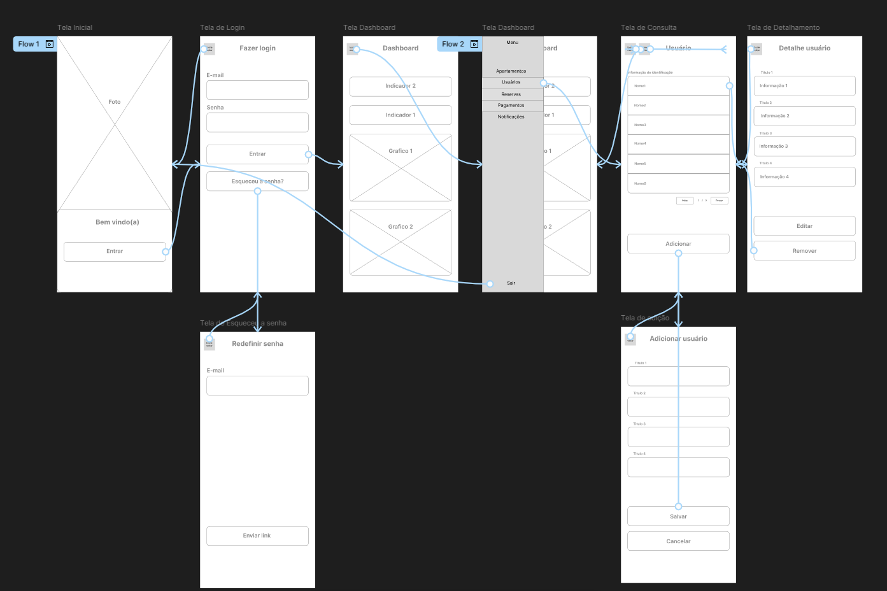
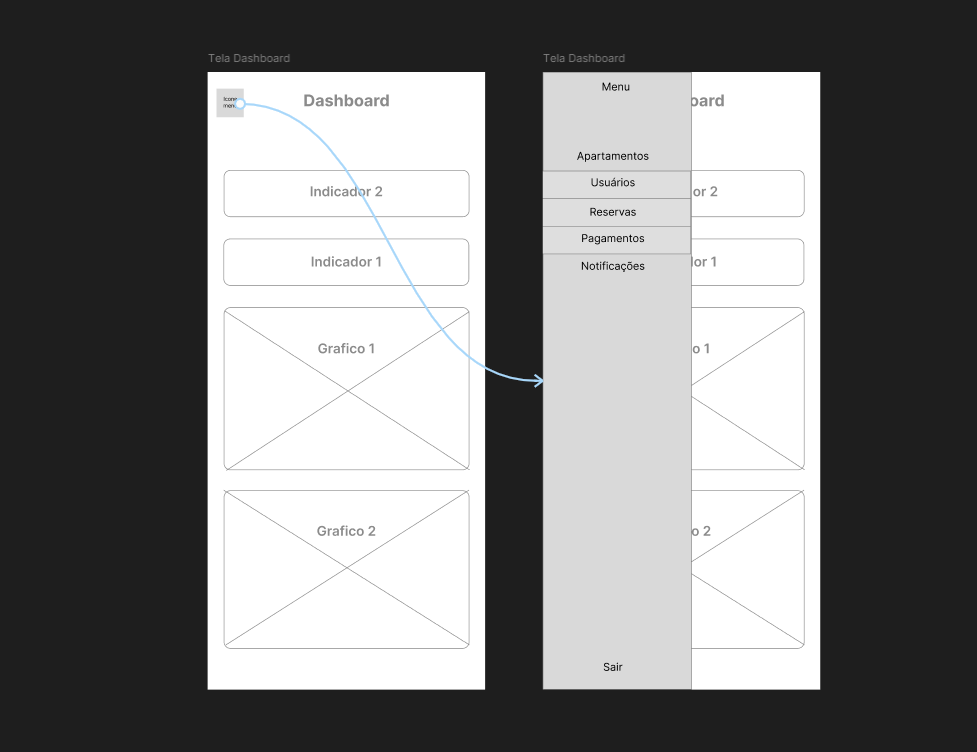
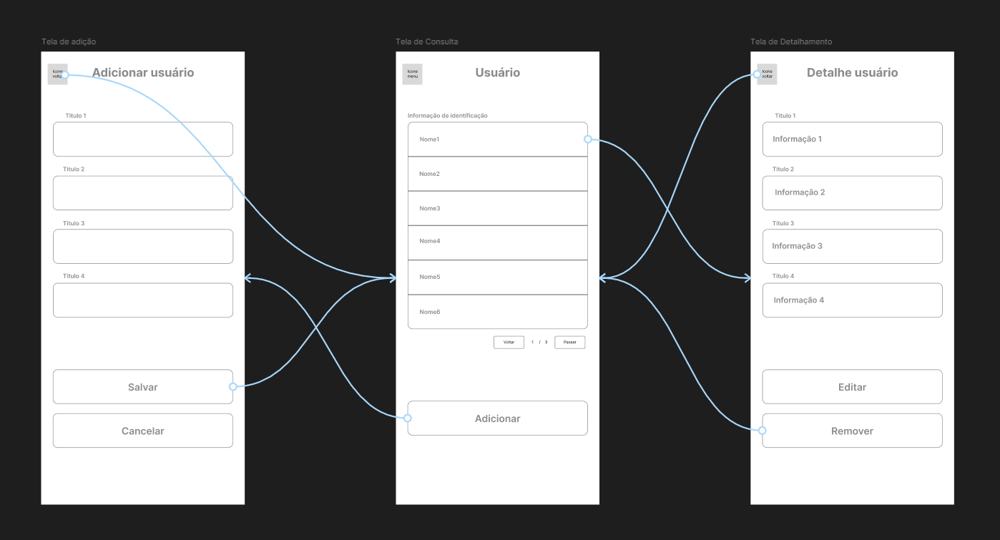
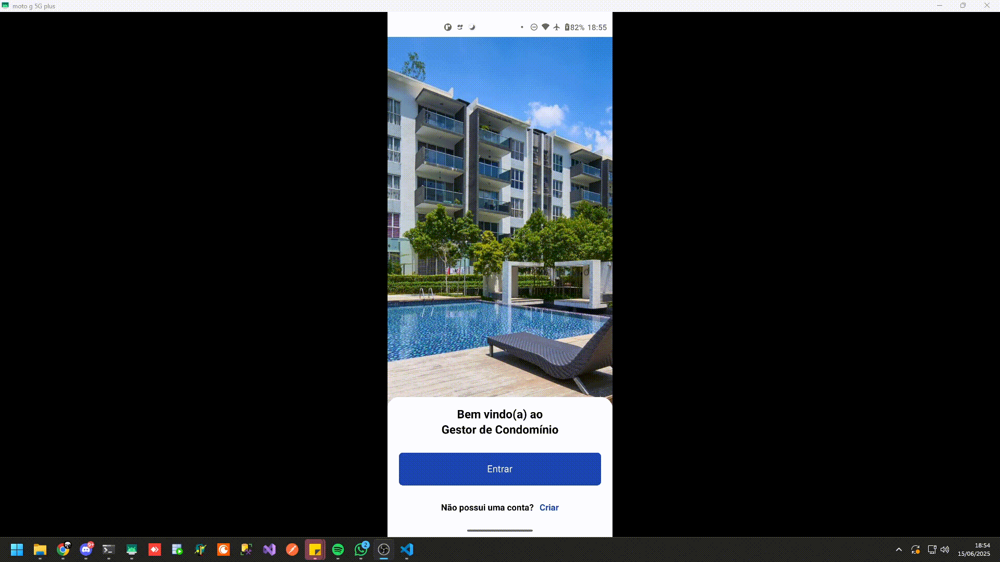
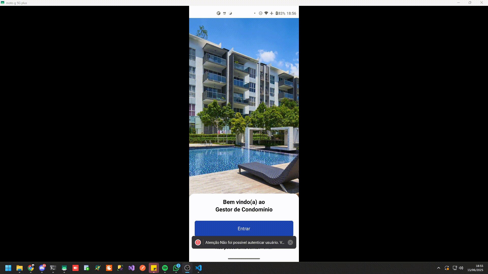
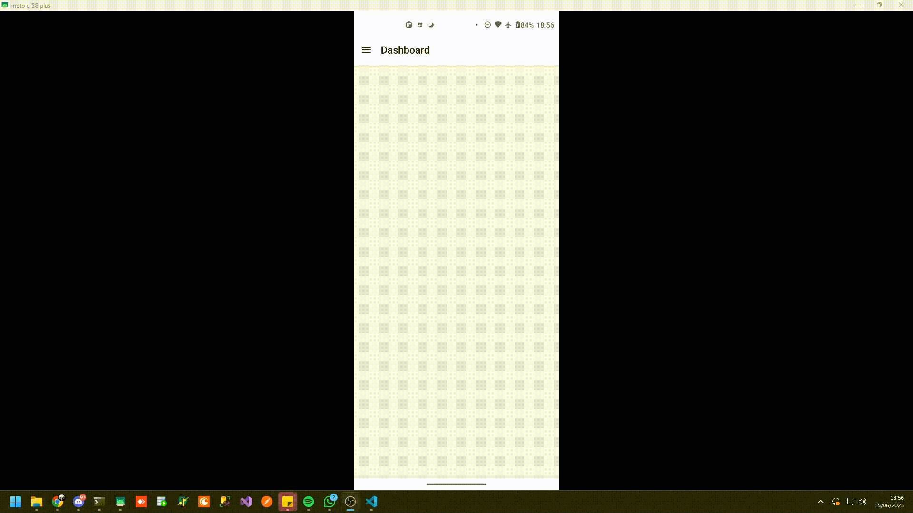
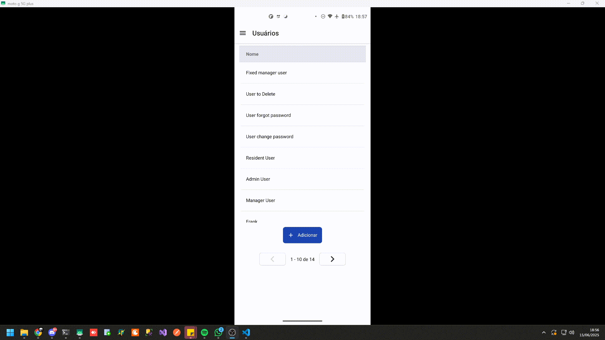
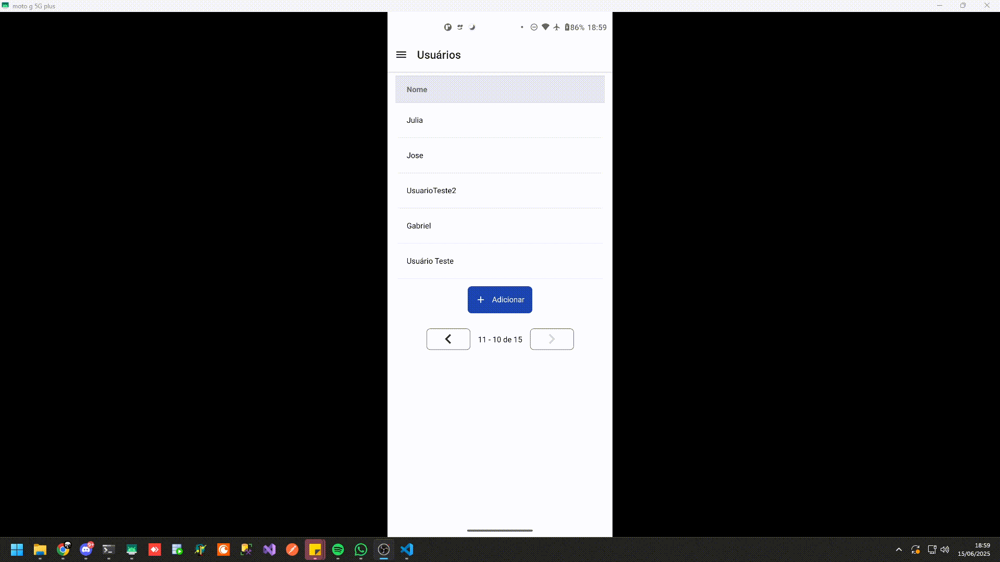
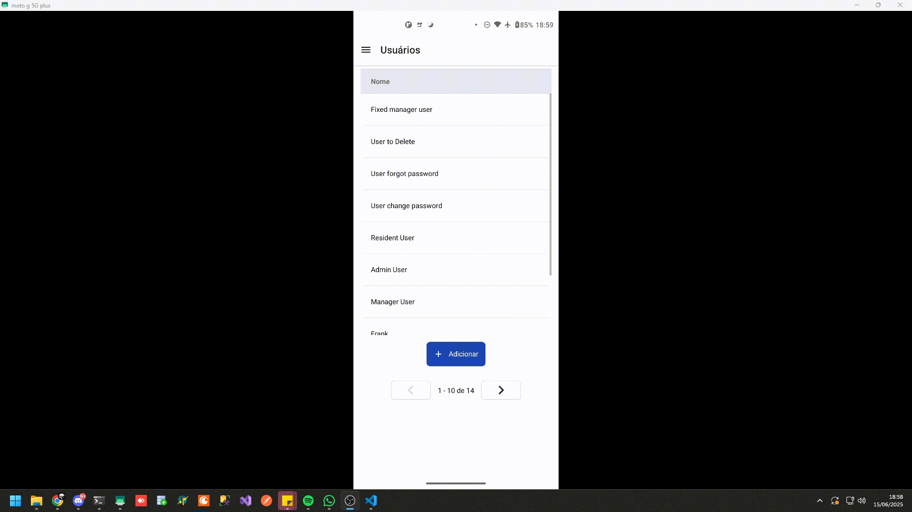
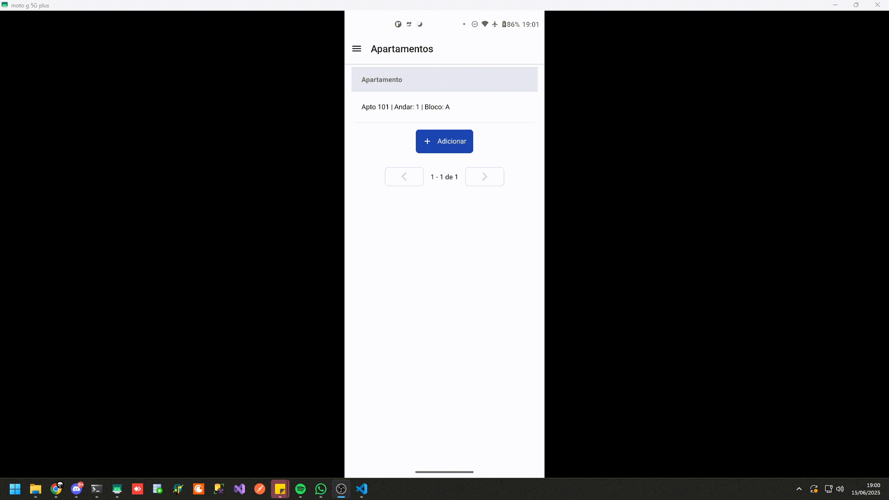

# Front-end Móvel

Este projeto consiste no desenvolvimento de uma interface mobile interativa para uma aplicação, cujo objetivo é permitir que usuários consultem, interajam e realizem operações em um sistema de administração de condomínios. A interface será projetada especificamente para dispositivos móveis, com foco em usabilidade, desempenho e adaptação a diferentes tamanhos de tela. A experiência do usuário será otimizada para interações por toque, garantindo uma navegação fluida, acessível e intuitiva. O design seguirá uma abordagem moderna e minimalista, alinhada às boas práticas de UX/UI mobile, visando facilitar o uso diário da aplicação em smartphones e tablets.

## Projeto da Interface

#### Dentro da aplicação

Uma vez autenticado, o usuário tem acesso a uma interface organizada e funcional, projetada para facilitar as rotinas do condomínio.

#### Estrutura e Telas Principais

* **Dashboard (Início):** Tela inicial que apresenta um resumo das informações mais relevantes, como avisos importantes, próximas reservas e atalhos para as funções mais utilizadas.
* **Tela de Comunicados:** Funciona como um mural digital, exibindo avisos, notícias e comunicados do síndico ou da administração.
* **Tela de Reservas de Áreas Comuns:** Interface que permite aos moradores visualizarem a disponibilidade de espaços (como salão de festas e churrasqueira) e realizarem agendamentos de forma simples.
* **Tela Financeira:** Seção para consulta de boletos, histórico de pagamentos e visualização de balancetes do condomínio.
* **Tela de Detalhes:** Exibe informações específicas ao ser acionada, como o conteúdo completo de um comunicado, os detalhes de uma reserva ou as informações de um boleto.
* **Tela de Usuários:** Exibe os usuários cadastrados permitindo ações como cadastro de novo usuários, visualização dos dados, edição e exclusão.
* **Tela de Apartamentos:** Exibe os apartamentos cadastrados permitindo ações como cadastro de novo apartamentos, visualização dos dados, edição e exclusão.

Em geral, a aplicação apresenta um design simples, porém robusto, capaz de entregar ao usuário uma experiencia de uso agradável e facilitada. O acesso fácil às informações mais importantes de forma segura e intuitiva faz da aplicação uma maneira objetiva de realizar consultas e solicitar serviços.

### Wireframes
 

<small>Wireframes individuais - [Ver pasta Wireframes](img/Wireframes_Mobile/Wireframes_individuais)</small>

Os wireframes foram desenvolvidos de modo a auxiliar no processo de desenvolvimento, dando clareza e direção à equipe, facilitando a visualização da estrutura e funcionalidade das interfaces antes da implementação final. Abaixo estão os principais wireframes e a descrição de seus fluxos.

**Tela Inicial, Login e Redefinir senha**

O fluxo de acesso do usuário começa na Tela Inicial de Boas-Vindas. Sua estrutura é composta por uma imagem de destaque, uma mensagem de saudação e um botão de chamada para ação "Entrar".

Ao acionar o botão, o usuário é direcionado para a Tela de Login. Nesta etapa, ele pode se autenticar na aplicação informando seu e-mail e senha. A tela também fornece um link para "Redefinir senha", que inicia o fluxo de recuperação de acesso caso o usuário tenha esquecido suas credenciais.
 

**Dashboard e Menu**
    

A Tela de Dashboard funciona como o painel de controle principal da aplicação. A tela é projetada para fornecer uma visão geral dos dados mais importantes através de cartões de indicadores (KPIs) e gráficos.

A navegação principal é consolidada em um menu lateral (drawer), acionado por um ícone no canto superior esquerdo. Ao ser ativado, o menu revela os links para as seções essenciais do sistema: Apartamentos, Usuários, Reservas, Pagamentos e Notificações. Na parte inferior do menu, a opção "Sair" permite que o usuário encerre sua sessão de forma segura.
 

**Padrão de Gerenciamento de informações (CRUD)**
 

Este conjunto de wireframes estabelece o fluxo padrão para o gerenciamento de registros na aplicação. O processo tem como ponto de partida uma Tela de Consulta, que exibe uma lista paginada dos itens cadastrados e oferece a ação principal de "Adicionar".

A partir da tela de consulta, o fluxo se desdobra:

* **Criação (Create):** Ao acionar "Adicionar", o usuário é levado à Tela de Adição, onde preenche um formulário com os dados necessários. A ação "Salvar" confirma a inclusão do novo registro e retorna à lista, enquanto "Cancelar" descarta a operação.

* **Leitura e Ações (Read, Update, Delete):** Ao selecionar um item da lista, o sistema exibe a Tela de Detalhamento, que apresenta todas as informações do registro selecionado. A partir desta tela, é possível:

    * Editar (Update): Aciona a tela de edição, que reutiliza a estrutura do formulário para modificar os dados existentes.

    * Remover (Delete): Exclui permanentemente o registro do sistema, retornando o usuário à tela de consulta.
    
    A aplicação emprega uma estrutura CRUD padronizada em todos os seus módulos de gerenciamento, variando apenas a entidade de dados exibida em cada tela.   

### Design Visual

O estilo visual da interface foi concebido para ser limpo, moderno e funcional, com uma paleta de cores que garante excelente legibilidade e foco no conteúdo.

#### Paleta de Cores

A paleta de cores foi definida a partir de um conjunto específico para garantir consistência visual em toda a aplicação.

* **Cor Primária (Ações):** Um tom de **azul profundo (`#1E40AF`)** é a cor principal, utilizada em botões de ação, links, ícones ativos e elementos que exigem atenção do usuário.
* **Cores Neutras (Base):**
    * **Branco (`#FFFFFF`)** e **Preto (`#000000`)** servem como a base da interface, para fundos e textos, garantindo máximo contraste.
    * A escala de **cinza** é usada para criar hierarquia e profundidade:
        * **`gray.500` (`#2D2D2D`)** funciona como a cor principal para texto de alta ênfase.
        * **`gray.400` (`#707070`)** para textos secundários, legendas e ícones inativos.
* **Cores de Feedback e Destaque:**
    * A paleta de **verde**, como **`green.500` (`#3ECF8F`)**, é utilizada para indicar sucesso, confirmações e status positivos. O tom mais claro, **`green.400` (`#70E1C1`)**, usado para fundos ou destaques sutis relacionados a uma ação bem-sucedida.

#### Tipografia

A escolha tipográfica prioriza a clareza e a legibilidade.

* **Fonte Principal:** Família de fontes **Sans-Serif** moderna.
* **Hierarquia e Peso:** A hierarquia é estabelecida através de diferentes pesos (Regular, Medium, Bold) e tamanhos de fonte, distinguindo claramente Títulos, Subtítulos, Corpo de texto e Legendas.

#### Iconografia

* **Estilo:** Os ícones seguem um estilo **minimalista e consistente**, predominantemente de linha (`outline`), para garantir que sejam facilmente reconhecíveis sem causar distração visual.
* **Aplicação:** São utilizados em pontos estratégicos, como na barra de navegação (Tab Bar), botões de ação e para ilustrar itens em listas, melhorando a identificação rápida das funcionalidades.

#### Elementos Gráficos e Componentes

* **Cards:** A informação é organizada em cards com **cantos arredondados** e **sombras sutis**, criando uma sensação de organização.
* **Botões:** Possuem cantos arredondados, com estados visuais claros para `normal`, `pressionado` e `desativado`.

## Fluxo de Dados

O fluxo de dados da aplicação seguirá o padrão **MVC (Model-View-Controller)** no frontend, utilizando requisições assíncronas via **API REST** para a comunicação com o backend.

O ciclo de uma interação típica pode ser descrito da seguinte forma:

1.  **Interação do Usuário:** O usuário interage com um componente na **`View`** (a interface gráfica).
    * *Exemplo: Tocar no botão "Reservar" em uma área comum.*

2.  **Disparo de Evento:** A **`View`** dispara um evento que é capturado pelo **`Controller`** correspondente.

3.  **Processamento e Requisição:** O **`Controller`** processa a lógica de negócio, monta os dados necessários e realiza uma chamada assíncrona para a **API REST** no backend.
    * *Exemplo: `POST /reservas` com os dados do agendamento.*

4.  **Resposta da API:** A **API** processa a requisição e retorna uma resposta com o resultado da operação (sucesso ou erro).

5.  **Atualização do Estado:** O **`Controller`** recebe e trata a resposta da API, atualizando o estado da aplicação.

6.  **Renderização da View:** A **`View`** é atualizada dinamicamente para refletir o novo estado, exibindo uma mensagem de confirmação ou erro para o usuário e atualizando a lista de reservas.

Este fluxo garante que a lógica de negócio, a manipulação de dados e a interface do usuário permaneçam desacopladas, facilitando a manutenção e a escalabilidade do código.

## Tecnologias Utilizadas

As principais tecnologias a serem utilizadas no mobile são:

TypeScript: linguagem de programação que adiciona tipagem estática ao JavaScript para maior segurança e produtividade.

Expo Go: plataforma para desenvolvimento rápido em React Native, facilitando o build e o teste em dispositivos reais.

React Native: framework para desenvolvimento de aplicativos móveis nativos utilizando React e JavaScript.

Tailwind CSS: framework de CSS utilitário para estilização rápida e responsiva.

Metro: bundler e servidor padrão do React Native, responsável por empacotar o código JavaScript para execução em dispositivos móveis.

## Considerações de Segurança

Para garantir a segurança da aplicação distribuída no front-end mobile, serão aplicadas as seguintes medidas:

1. Autenticação baseada em tokens JWT, armazenados de forma segura usando o Secure Storage nativo (ex: Keychain no iOS, Keystore no Android) ao invés de localStorage, para proteção contra roubo de tokens.

2. Proteção contra ataques de injeção e XSS através da validação e sanitização dos dados de entrada, além do uso de bibliotecas seguras e práticas recomendadas para evitar execução de código malicioso.

3. Controle de acesso e autorização baseado em permissões do usuário (RBAC) para garantir que apenas usuários autenticados e autorizados possam acessar funcionalidades sensíveis.

4. Comunicação segura via HTTPS/TLS obrigatório em todas as requisições para garantir a confidencialidade e integridade dos dados trafegados.

5. Validação rigorosa dos dados no front-end e no backend, evitando envio e processamento de dados inválidos ou maliciosos.

6. Proteção contra vulnerabilidades específicas de dispositivos móveis, como captura de tela sensível, prevenção de engenharia reversa (ofuscação do código) e uso de políticas de segurança no app (ex: App Transport Security no iOS).

7. Uso de bibliotecas confiáveis e atualizadas para gerenciamento de sessões, criptografia e armazenamento seguro.

## Implantação

[Instruções para implantar a aplicação distribuída em um ambiente de produção.]

1. Defina os requisitos de hardware e software necessários para implantar a aplicação em um ambiente de produção.
2. Escolha uma plataforma de hospedagem adequada, como um provedor de nuvem ou um servidor dedicado.
3. Configure o ambiente de implantação, incluindo a instalação de dependências e configuração de variáveis de ambiente.
4. Faça o deploy da aplicação no ambiente escolhido, seguindo as instruções específicas da plataforma de hospedagem.
5. Realize testes para garantir que a aplicação esteja funcionando corretamente no ambiente de produção.

## Testes

### Teste LOGIN1 - Formulário em branco

* Entrada: Tentar realizar login com o formulário estando em branco (sem preenchimento)
* Saída esperada: Exibir erros informando campos de preenchimento obrigatório
* Evidência:

### Teste LOGIN2 - Formulário preenchido corretamente com usuário inválido

* Entrada: Realizar login com o formulário preenchido corretamente e usuário / senha incorretos
* Saída esperada: Exibir mensagem informando sobre usuário/senha inválidos
* Evidência:

### Teste LOGIN3 - Formulário preenchido corretamente com usuário válido

* Entrada: Realizar login com o formulário preenchido corretamente e usuário / senha corretos
* Saída esperada: Entrar na aplicação normalmente
* Evidência:

### Teste USR1 - Formulário em branco

* Entrada: Tentar criar um usuário com o formulário estando em branco (sem preenchimento)
* Saída esperada: Exibir erros informando campos de preenchimento obrigatório
* Evidência:

### Teste USR2 - Formulário preenchido com valores inválidos (Criação)

* Entrada: Tentar criar um usuário com o formulário estando com valores inválidos
* Saída esperada: Exibir erros informando quais campos estão inválidos
* Evidência:

### Teste USR3 - Formulário preenchido com valores inválidos (Edição)

* Entrada: Tentar editar um usuário com o formulário estando com valores inválidos
* Saída esperada: Exibir erros informando quais campos estão inválidos
* Evidência:

### Teste USR4 - Formulário preenchido corretamente

* Entrada: Tentar criar um usuário com o formulário preenchido corretamente
* Saída esperada: Usuário deve ser criado e exibido na listagem
* Evidência:

### Teste USR5 - Editar usuário pré-cadastrado

* Entrada: Tentar editar um usuário
* Saída esperada: Usuário deve possuir edição efetivada e atualizada na tela
* Evidência:

### Teste USR6 - Exclusão usuário pré-cadastrado

* Entrada: Tentar excluir um usuário
* Saída esperada: Deve-se exibir mensagem de confirmação de exclusão e após confirmação o usuário deve ser excluído
* Evidência:

### Teste APTO1 - Formulário preenchido com valores inválidos

* Entrada: Tentar criar um apartamento com o formulário estando com valores inválidos
* Saída esperada: Exibir erros informando quais campos estão inválidos
* Evidência:

### Teste APTO2 - Formulário preenchido com valores inválidos

* Entrada: Tentar editar um apartamento com o formulário estando com valores inválidos
* Saída esperada: Exibir erros informando quais campos estão inválidos
* Evidência:

### Teste APTO3 - Formulário preenchido corretamente

* Entrada: Tentar criar um apartamento com o formulário preenchido corretamente
* Saída esperada: Apartamento deve ser criado e exibido na listagem
* Evidência:

### Teste APTO4 - Editar apartamento pré-cadastrado

* Entrada: Tentar editar um apartamento
* Saída esperada: Apartamento deve possuir edição efetivada e atualizada na tela
* Evidência:

### Teste APTO5 - Exclusão apartamento pré-cadastrado

* Entrada: Tentar excluir um apartamento
* Saída esperada: Deve-se exibir mensagem de confirmação de exclusão e após confirmação o apartamento deve ser excluído
* Evidência:

# Referências

FONSECA, Kakau. Mobile design: 5 boas práticas para desenhar interfaces. UX Collective 🇧🇷, 25 abr. 2018. Disponível em: https://uxdesign.cc/mobile-design-5-boas-pr%C3%A1ticas-para-desenhar-interfaces-e7a2a6d7a465. Acesso em: 14 mai. 2025.

MIRO. O que é wireframe? Disponível em: https://miro.com/pt/wireframe/o-que-e-wireframe/. Acesso em:  14 mai. 2025.

WONG, Euphemia. User Interface Design Guidelines: 10 Rules of Thumb. The Interaction Design Foundation, 14 mar. 2025. Disponível em: https://www.interaction-design.org/literature/article/user-interface-design-guidelines-10-rules-of-thumb. Acesso em: 15 mai. 2025.
